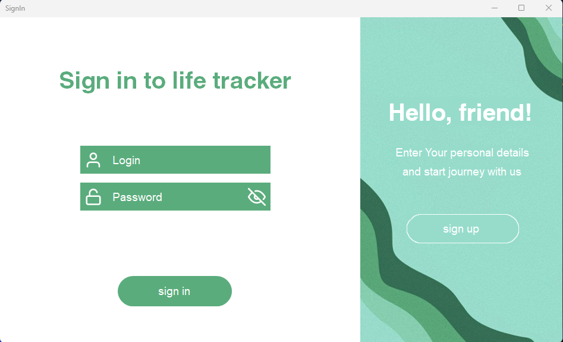

# Authorization-registration-menu
Проект продставляет собой окна авторизации и регитсрации аккаунтов. Он написан для упрощения написания проектов в будущем, чтобы не приходилось возвращаться к одному и тому же.
___
# Установка 
* Скачайие проект по удобному для вас пути.
* После это необходимо изменить сторку подключения к локальной базе данных: users.mdf
  * Для этого внесите новый путь к базе в файл App.config.
* Поздравляю! Проекто можно использовать.
___
# Описание 
* Окно авториации
  * В левой части происход авторизация;
  * В правой же можно перейти к регистрации

* Окно регистрации
  * В левой части можно перейти к авторизации
  * В правой части происходит авторизация

