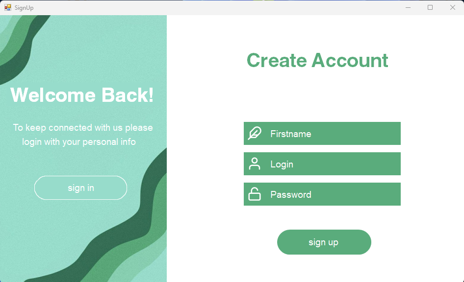

# Authorization-registration-menu
Проект продставляет собой окна авторизации и регитсрации аккаунтов. Он написан для упрощения написания проектов в будущем, чтобы не приходилось возвращаться к одному и тому же.
___
# Технологии
* Windows Forms
* Entity Framework
___
# Описание 
* Окно авториации
  * В левой части происход авторизация;
  * В правой же можно перейти к регистрации

* Окно регистрации
  * В левой части можно перейти к авторизации
  * В правой части происходит авторизация

